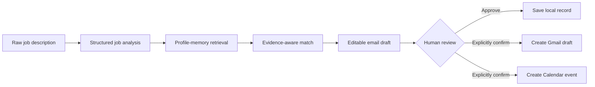

<div align="center">

# JobCopilot

### Evidence-grounded, human-supervised agentic AI for job applications

JobCopilot turns a raw job description into a structured and reviewable workflow: offer extraction, semantic profile retrieval, candidate-to-role matching, tailored email drafting, local application tracking and explicitly approved Gmail or Calendar actions.


</div>

---

## Why this project exists

Job applications are repetitive and often written from generic summaries rather than verifiable candidate evidence.

JobCopilot explores a safer workflow:

1. extract requirements explicitly stated in an offer;
2. retrieve only relevant candidate memories;
3. separate strengths, gaps and positioning suggestions;
4. draft an email from the retrieved evidence;
5. keep the human in control before external side effects;
6. track the application and prepare a follow-up;
7. measure extraction, retrieval and grounding rather than relying on screenshots alone.

The project is not designed for indiscriminate mass applications. It is a **traceable, local and supervised AI engineering case study**.

---

## Recruiter quick scan

| Capability | Current implementation |
| --- | --- |
| Structured job understanding | Anthropic LLM output validated with Pydantic |
| Candidate memory | Hugging Face embeddings and FAISS retrieval |
| Evidence-aware matching | Explicit strengths, gaps and relevant profile memories |
| Email generation | Structured and editable application draft |
| Deterministic orchestration | Stateless LangGraph pipeline |
| Conversational orchestration | LangGraph tool-calling agent with isolated chat threads |
| Gmail and Calendar | Local Google OAuth with explicit confirmation gates |
| Persistence | Atomic local JSON writes with duplicate checks |
| Evaluation | Stratified smoke suite, 50-offer benchmark, retrieval and grounding protocols |
| Delivery | Streamlit UI, Dockerfile and GitHub Actions CI |

---

## System architecture



### Deterministic pipeline

```text
analyze_job
    -> retrieve_memory
    -> generate_match
    -> generate_email
```

The deterministic graph is stateless. Separate analyses therefore do not share a workflow checkpoint.

### Tool-calling agent

The conversational agent can:

- run the JobCopilot pipeline;
- preview Gmail and Calendar actions;
- save application records;
- list saved applications.

Gmail and Calendar tools require `confirmed=true`. The agent must show the exact action and request confirmation before the side effect is allowed.

---

## Reliability and safety choices

### Structured outputs

`JobAnalysis`, `MatchInsight`, `EmailDraft` and `ApplicationRecord` are validated with Pydantic. Required text, reminder dates, email subjects and ISO timestamps have explicit validation boundaries.

### Evidence grounding

The matching prompt is restricted to the structured offer and retrieved candidate memories. The email prompt must not convert a suggestion or unsupported skill into a candidate claim.

### Contract-type guardrail

The job title and contract type are treated as separate evidence. Words such as `Intern`, `Apprentice`, `Fellow`, `Consultant` or `Freelance` inside a title do not determine `contract_type`. The field must be `Unknown` unless the offer explicitly states the employment or contract type.

### External-action approval

The agent cannot create a Gmail draft or Calendar event only because a user mentioned one. It first returns a preview and requires explicit confirmation of the final values.

### Safer FAISS handling

Persisted LangChain FAISS stores include pickle-backed metadata. Deserialization is disabled by default. JobCopilot rebuilds the in-memory index from auditable JSON and caches it for the process lifetime.

Loading a persisted index requires:

```env
ALLOW_TRUSTED_FAISS_DESERIALIZATION=true
```

Enable this only for an index generated locally and kept on a trusted machine.

### Atomic local persistence

Application records are written through a temporary file and atomically replace the target JSON file. Invalid JSON raises an explicit error instead of silently behaving like an empty database.

### Input validation

Before Gmail or Calendar calls, JobCopilot validates:

- email addresses;
- empty bodies and subjects;
- newline-based header injection attempts;
- follow-up date format;
- event start and end ordering.

See [`SECURITY.md`](SECURITY.md) for the complete trust model.

---

## Public demo data and private profile data

The repository ships with a fictional candidate profile:

```text
data/profile_memories.example.json
```

For a personal local profile:

1. copy the example to `data/profile_memories.json`;
2. replace the entries with verified evidence;
3. set:

```env
PROFILE_MEMORIES_FILE=data/profile_memories.json
```

Private profile data, OAuth credentials, tokens and generated application records are ignored by Git.

---

## Evaluation protocol 1.1

The evaluation protocol separates direct extraction from generated recommendations.

### Scored extraction fields

Scalar fields:

- company;
- role;
- location;
- contract type;
- start date.

List fields:

- missions summary;
- required skills;
- preferred skills;
- tools and stack;
- domain focus.

`key_highlights_for_candidate` remains visible in reports but is excluded from extraction F1 because it is a generated recommendation field.

The scorer normalizes documented acronym and expanded-form equivalents such as:

- NLP / natural language processing;
- RAG / retrieval-augmented generation;
- LLM / large language model;
- API / application programming interface;
- CV / computer vision.

Semantic modifiers remain distinct: `responsible AI` is not treated as equivalent to `agentic AI`.

---

## Benchmark suites

### 1. Stratified smoke suite

The dedicated five-case suite is bilingual and covers five distinct role categories plus easy, medium and hard cases.

```bash
python scripts/evaluate_job_extraction.py \
  --dataset evaluation/job_offers.smoke.v1.jsonl \
  --benchmark-version smoke-1.0.0
```

It includes missing fields, a contract-inference trap and conflicting location context.

### 2. Full extraction benchmark

The full Benchmark V1 contains 50 synthetic English offers across 10 role families.

```bash
python scripts/evaluate_job_extraction.py \
  --dataset evaluation/job_offers.v1.jsonl \
  --benchmark-version 1.0.0
```

The report contains:

- aggregate scalar accuracy and macro extraction-list F1;
- accuracy or F1 by individual field;
- slices by language, category and difficulty when available;
- case-level predictions;
- model name, dataset version, evaluation-protocol version, dataset hash, prompt hash and timestamp.

### 3. Profile-memory retrieval

```bash
python scripts/evaluate_retrieval.py
```

Reported metrics:

- Recall@1, Recall@3 and Recall@5;
- MRR;
- NDCG@1, NDCG@3 and NDCG@5.

### 4. Static grounding-label classification

```bash
python scripts/evaluate_grounding.py \
  --predictions evaluation/results/grounding_predictions.jsonl
```

This measures grounding-label classification against isolated claims and evidence references.

### 5. Generated-email grounding review

```bash
python scripts/prepare_email_grounding_review.py --limit 10
```

Reviewers label factual candidate claims as `supported`, `unsupported` or `ambiguous`.

```bash
python scripts/summarize_email_grounding_review.py \
  --annotations evaluation/results/email_grounding_review.jsonl
```

See [`evaluation/README.md`](evaluation/README.md) for the complete protocol.

> Current datasets are synthetic and manually authored. Results support regression testing and comparative engineering experiments, not production-accuracy or job-market-generalization claims.

---

## Secure GitHub Actions benchmark

The `JobCopilot Benchmark` workflow is manual. It does not run on pushes, pull requests or schedules.

- option `5`: runs the bilingual stratified smoke suite;
- option `50`: runs the full Benchmark V1 dataset.

The workflow reads `ANTHROPIC_API_KEY` from GitHub Actions Secrets, publishes aggregate metrics and uploads the complete JSON report as a 30-day artifact.

See [`evaluation/GITHUB_ACTIONS.md`](evaluation/GITHUB_ACTIONS.md).

---

## Repository structure

```text
app/
  agent_graph.py
  agent_tools.py
  config.py
  evaluation.py
  graph.py
  grounding_review.py
  memory.py
  prompts.py
  schemas.py
  services/
  tools/
  ui/

data/
  profile_memories.example.json

evaluation/
  GITHUB_ACTIONS.md
  README.md
  email_grounding_review.example.jsonl
  grounding_cases.v1.jsonl
  job_offers.smoke.v1.jsonl
  job_offers.v1.jsonl
  retrieval_cases.v1.jsonl

scripts/
  evaluate_grounding.py
  evaluate_job_extraction.py
  evaluate_retrieval.py
  prepare_email_grounding_review.py
  summarize_email_grounding_review.py
  validate_benchmark.py

tests/
.github/workflows/
  benchmark.yml
  ci.yml
Dockerfile
SECURITY.md
```

---

## Local setup

```bash
git clone https://github.com/EL-K-Code/Job-Copilot.git
cd Job-Copilot
python -m venv .venv
```

Linux or macOS:

```bash
source .venv/bin/activate
```

Windows PowerShell:

```powershell
.venv\Scripts\Activate.ps1
```

Install dependencies:

```bash
pip install -r requirements.txt
```

For tests:

```bash
pip install -r requirements-dev.txt
```

Configure local variables:

```bash
cp .env.example .env
```

At minimum:

```env
ANTHROPIC_API_KEY=your_local_key
ANTHROPIC_MODEL=your_supported_model
```

Never commit the resulting `.env` file.

Run the application:

```bash
streamlit run app/ui/streamlit_app.py --server.address 127.0.0.1 --server.port 8501
```

---

## Google OAuth setup

To enable Gmail and Calendar locally:

1. create a Google Cloud project;
2. enable Gmail API and Google Calendar API;
3. configure the OAuth consent screen;
4. create a Desktop OAuth client;
5. save the downloaded file as `credentials.json`;
6. run:

```bash
python -m app.bootstrap_gmail_auth
```

The OAuth file and generated tokens are ignored by Git.

---

## Docker

```bash
docker build -t jobcopilot .
```

```bash
docker run --rm -p 8501:8501 \
  --env-file .env \
  -v "$(pwd)/data:/app/data" \
  -v "$(pwd)/tokens:/app/tokens" \
  -v "$(pwd)/credentials.json:/app/credentials.json:ro" \
  jobcopilot
```

Do not bake credentials, OAuth tokens or personal profile files into the image.

---

## Tests and CI

```bash
python -m compileall -q app scripts tests
python scripts/validate_benchmark.py
pytest -q
```

GitHub Actions validates syntax, benchmark integrity and unit tests for pull requests and pushes to `main`.

The suite covers:

- duplicate detection and atomic JSON persistence;
- corrupted-store behavior;
- agent confirmation gates;
- Gmail and Calendar validation;
- schema validation;
- extraction, retrieval and grounding metrics;
- acronym normalization and recommendation-field exclusion;
- stratified smoke-suite integrity;
- generated-email grounding-review validation.

---

## Current boundaries

JobCopilot remains a **local engineering MVP**, not a production service.

Known limitations:

- JSON persistence is not transactional across concurrent processes;
- the agent checkpointer is in memory;
- there is no authentication or multi-user authorization;
- no public hosted deployment is configured;
- the full Benchmark V1 is synthetic and English-only;
- generated-email grounding requires human claim segmentation and review;
- retrieval has no learned reranker or calibrated relevance threshold;
- Gmail and Calendar rely on local desktop OAuth;
- observability does not yet provide full traces, cost accounting or redacted audit logs.

---

## Roadmap

1. rerun the corrected stratified smoke suite;
2. run and publish controlled results on the frozen 50-offer benchmark;
3. complete generated-email grounding review;
4. add independent annotation and adjudication;
5. add licensed or redistributable real-world offers;
6. migrate persistence to SQLite;
7. introduce structured tracing and redacted audit logs;
8. add retrieval reranking and calibrated relevance thresholds;
9. publish screenshots and a short synthetic-data demonstration.

---

## Author

**Komla Alex LABOU**  
Applied AI and Machine Learning Engineer — Research-Oriented

- GitHub: [EL-K-Code](https://github.com/EL-K-Code)
- LinkedIn: [komla-alex-labou](https://www.linkedin.com/in/komla-alex-labou/)
