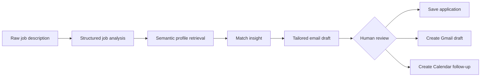

<div align="center">

# JobCopilot

### An agentic AI workflow for evidence-grounded job applications

JobCopilot turns a raw job description into a structured, reviewable application workflow: offer analysis, semantic profile retrieval, candidate-to-role matching, tailored email drafting, application tracking and follow-up actions.


</div>

---

## Why this project exists

Job applications are often repetitive, fragmented and poorly grounded in the candidate's actual experience.

JobCopilot explores a more reliable workflow:

1. extract the real requirements of an offer;
2. retrieve only the most relevant candidate evidence;
3. identify strengths and gaps explicitly;
4. draft an application from that evidence;
5. keep the human in control before external actions;
6. save the application and prepare a follow-up.

The objective is not to automate indiscriminate mass applications. It is to build a **traceable and supervised AI assistant** that helps a candidate apply more consistently and with better evidence.

---

## Recruiter quick scan

| Capability | Implementation |
| --- | --- |
| Structured job understanding | LLM extraction validated with Pydantic schemas |
| Candidate memory | Hugging Face embeddings and FAISS semantic retrieval |
| Candidate-to-role analysis | Explicit strengths, gaps and positioning angles |
| Email generation | Structured, editable application draft |
| Workflow orchestration | Deterministic LangGraph pipeline |
| Agentic interaction | Tool-calling LangGraph agent |
| External integrations | Gmail draft creation and Google Calendar reminders |
| User interface | Streamlit application |
| Persistence | Local JSON application records |
| Safety controls | Structured outputs, evidence retrieval and duplicate-action checks |

---

## System overview



JobCopilot exposes two complementary execution modes.

### Deterministic workflow

A fixed LangGraph pipeline runs:

```text
analyze_job
    -> retrieve_memory
    -> generate_match
    -> generate_email
```

This mode is useful when predictable execution and transparent intermediate states are preferred.

### Tool-calling agent

A LangGraph agent can decide when to call tools for:

- running the full JobCopilot pipeline;
- creating a Gmail draft;
- saving an application;
- creating a Calendar reminder;
- listing saved applications.

This mode explores natural-language interaction while keeping operational capabilities behind explicit tools.

---

## Core features

### 1. Structured job analysis

A raw offer is converted into a validated `JobAnalysis` object containing:

- company and role;
- location and contract type;
- expected start date;
- required and preferred skills;
- tools and technical stack;
- responsibilities;
- domain focus;
- candidate highlights.

### 2. Semantic profile memory

Candidate information is represented as structured memory entries and indexed with:

- `sentence-transformers/all-MiniLM-L6-v2` embeddings;
- a local FAISS vector store;
- similarity-based retrieval for role-specific evidence.

This prevents every application from relying on the same generic profile summary.

### 3. Evidence-aware matching

The system combines the structured offer and retrieved profile evidence to generate:

- matching strengths;
- credible gaps;
- recommended positioning angles;
- the profile memories used in the analysis.

### 4. Tailored email drafting

The application generates a structured `EmailDraft` containing:

- subject;
- editable body;
- requested tone.

The draft is shown to the user before any Gmail action.

### 5. Application tracking

Each application record can include:

- company and role;
- source and status;
- notes;
- email subject and body;
- reminder date;
- creation timestamp.

### 6. Gmail and Calendar integration

After review, the user can:

- create a real Gmail draft;
- create a Google Calendar follow-up reminder.

OAuth credentials and tokens remain local and must never be committed.

---

## Reliability choices

JobCopilot currently includes several practical safeguards:

- **Pydantic-constrained outputs** for job analysis, matching and email drafts;
- **retrieval grounding** through explicit candidate memories;
- prompts designed to reduce unsupported candidate claims;
- duplicate checks for saved applications;
- duplicate checks for repeated reminders;
- editable drafts before external actions;
- deterministic temperature settings for the agent model.

These controls reduce avoidable errors, but they do not make the current MVP production-ready.

---

## Current boundaries

The repository should be read as a **working local MVP and engineering case study**.

Current limitations include:

- local JSON persistence instead of PostgreSQL or SQLite;
- in-memory LangGraph checkpoints;
- no multi-user authentication or authorization;
- no public production deployment configuration;
- no complete benchmark suite yet for extraction, retrieval or email grounding;
- Gmail and Calendar integrations depend on local Google OAuth;
- the current vector index is trusted local state and is not intended for untrusted uploads.

These limitations are documented intentionally to separate implemented capabilities from future work.

---

## Technology stack

### AI and orchestration

- LangChain
- LangGraph
- Anthropic Claude
- Hugging Face embeddings
- FAISS
- Pydantic

### Application layer

- Python
- Streamlit
- Gmail API
- Google Calendar API

### Current persistence

- JSON application store
- JSON profile memory store
- local FAISS index

---

## Repository structure

```text
app/
  bootstrap_gmail_auth.py
  config.py
  graph.py
  main.py
  memory.py
  prompts.py
  schemas.py
  state.py

  agent_graph.py
  agent_state.py
  agent_tools.py

  services/
    applications_store.py
    llm.py

  tools/
    gmail_tools.py
    calendar_tools.py

  ui/
    streamlit_app.py

data/
  profile_memories.json
  applications.json          # local runtime file
  faiss_index/               # generated locally

tokens/                      # local OAuth tokens, ignored
credentials.json             # local OAuth configuration, ignored
.env                         # local secrets, ignored
```

---

## Local setup

### 1. Clone the repository

```bash
git clone https://github.com/EL-K-Code/Job-Copilot.git
cd Job-Copilot
```

### 2. Create a virtual environment

Linux or macOS:

```bash
python -m venv .venv
source .venv/bin/activate
```

Windows PowerShell:

```powershell
python -m venv .venv
.venv\Scripts\Activate.ps1
```

### 3. Install dependencies

```bash
pip install -r requirements.txt
```

### 4. Configure environment variables

Create a local `.env` file:

```env
ANTHROPIC_API_KEY=your_anthropic_api_key
ANTHROPIC_MODEL=your_supported_model

GOOGLE_CLIENT_SECRET_FILE=credentials.json
GOOGLE_TOKEN_DIR=tokens
MEMORY_INDEX_DIR=data/faiss_index
APPLICATIONS_FILE=data/applications.json
PROFILE_MEMORIES_FILE=data/profile_memories.json
```

### 5. Prepare local data

`data/applications.json`:

```json
[]
```

Example `data/profile_memories.json`:

```json
[
  {
    "id": "experience_1",
    "type": "experience",
    "content": "Designed and evaluated a biometric duplicate-detection pipeline."
  },
  {
    "id": "project_1",
    "type": "project",
    "content": "Built an agentic job-application workflow with LangGraph and FAISS."
  }
]
```

### 6. Configure Google OAuth

To enable Gmail and Calendar actions:

1. create a Google Cloud project;
2. enable Gmail API and Google Calendar API;
3. configure the OAuth consent screen;
4. create a Desktop OAuth client;
5. store the downloaded file locally as `credentials.json`;
6. run:

```bash
python -m app.bootstrap_gmail_auth
```

### 7. Run the application

Backend workflow check:

```bash
python -m app.main
```

Streamlit interface:

```bash
streamlit run app/ui/streamlit_app.py --server.address 127.0.0.1 --server.port 8501
```

---

## Security

Never commit:

- `.env`;
- `credentials.json`;
- OAuth tokens;
- private candidate profile memories;
- real application records containing personal information.

Before deploying a derivative of this project, replace local secret handling, isolate user sessions, review tool permissions and add an explicit approval boundary before every external side effect.

---

## Evaluation roadmap

The next major milestone is to evaluate the system rather than only expand its features.

Planned evaluation dimensions:

- field-level accuracy of job-offer extraction;
- Recall@k and ranking quality for profile-memory retrieval;
- percentage of generated candidate claims supported by retrieved evidence;
- email relevance and factuality under human review;
- tool-call success and duplicate-action rate;
- latency and model cost per completed workflow;
- regression tests across prompt and model versions.

---

## Engineering roadmap

- add automated unit and integration tests;
- pin and lock dependency versions;
- isolate agent and workflow sessions;
- migrate persistence to SQLite or PostgreSQL;
- introduce explicit approval gates for external actions;
- add tracing, structured logs and evaluation datasets;
- containerize the application;
- publish a safe demo using synthetic profile data;
- add screenshots and a short demonstration video.

---

## What this project demonstrates

JobCopilot is designed to demonstrate more than prompt engineering:

- applied LLM engineering;
- structured extraction and validation;
- retrieval-augmented reasoning;
- semantic memory;
- LangGraph workflow and agent design;
- external tool integration;
- human-supervised automation;
- product and reliability thinking.

---

## Author

**Alex Komla LABOU**  
Applied AI and Machine Learning Engineer — Research-Oriented

- GitHub: [EL-K-Code](https://github.com/EL-K-Code)
- LinkedIn: [komla-alex-labou](https://www.linkedin.com/in/komla-alex-labou/)
