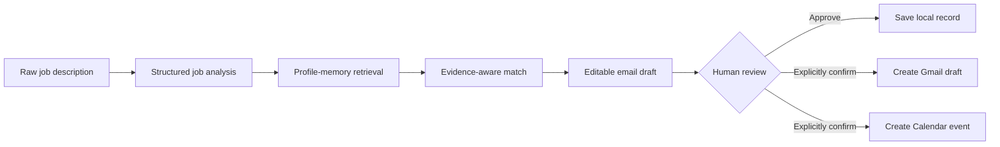

<div align="center">

# JobCopilot

### Evidence-grounded, human-supervised agentic AI for job applications

JobCopilot turns a raw job description into a structured and reviewable workflow: offer extraction, semantic profile retrieval, candidate-to-role matching, tailored email drafting, local application tracking and explicitly approved Gmail or Calendar actions.


</div>

---

## Why this project exists

Job applications are repetitive and often written from generic summaries rather than verifiable candidate evidence.

JobCopilot explores a safer workflow:

1. extract requirements explicitly stated in an offer;
2. retrieve only relevant candidate memories;
3. separate strengths, gaps and positioning suggestions;
4. draft an email from the retrieved evidence;
5. keep the human in control before external side effects;
6. track the application and prepare a follow-up;
7. measure extraction, retrieval and grounding rather than relying on screenshots alone.

The project is not designed for indiscriminate mass applications. It is a **traceable, local and supervised AI engineering case study**.

---

## Recruiter quick scan

| Capability | Current implementation |
| --- | --- |
| Structured job understanding | Anthropic LLM output validated with Pydantic |
| Candidate memory | Hugging Face embeddings and FAISS retrieval |
| Evidence-aware matching | Explicit strengths, gaps and relevant profile memories |
| Email generation | Structured and editable application draft |
| Deterministic orchestration | Stateless LangGraph pipeline |
| Conversational orchestration | LangGraph tool-calling agent with isolated chat threads |
| Gmail and Calendar | Local Google OAuth with explicit confirmation gates |
| Persistence | Atomic local JSON writes with duplicate checks |
| Evaluation | 50 offers, 20 retrieval cases, static grounding and generated-email review |
| Delivery | Streamlit UI, Dockerfile and GitHub Actions CI |

---

## System architecture



### Deterministic pipeline

```text
analyze_job
    -> retrieve_memory
    -> generate_match
    -> generate_email
```

The deterministic graph is stateless. Separate analyses therefore do not share a workflow checkpoint.

### Tool-calling agent

The conversational agent can:

- run the JobCopilot pipeline;
- preview Gmail and Calendar actions;
- save application records;
- list saved applications.

Gmail and Calendar tools require `confirmed=true`. The agent must show the exact action and request confirmation before the side effect is allowed.

---

## Reliability and safety choices

### Structured outputs

`JobAnalysis`, `MatchInsight`, `EmailDraft` and `ApplicationRecord` are validated with Pydantic. Required text, reminder dates, email subjects and ISO timestamps have explicit validation boundaries.

### Evidence grounding

The matching prompt is restricted to the structured offer and retrieved candidate memories. The email prompt must not convert a suggestion or unsupported skill into a candidate claim.

### External-action approval

The agent cannot create a Gmail draft or Calendar event only because a user mentioned one. It first returns a preview and requires explicit confirmation of the final values.

The dedicated Streamlit buttons represent direct user approval because the editable values are visible before the click.

### Safer FAISS handling

Persisted LangChain FAISS stores include pickle-backed metadata. Deserialization is disabled by default.

JobCopilot rebuilds the in-memory index from auditable JSON and caches it for the process lifetime. Loading a persisted index requires:

```env
ALLOW_TRUSTED_FAISS_DESERIALIZATION=true
```

Enable this only for an index generated locally and kept on a trusted machine.

### Atomic local persistence

Application records are written through a temporary file and atomically replace the target JSON file. Invalid JSON raises an explicit error instead of silently behaving like an empty database.

### Input validation

Before Gmail or Calendar calls, JobCopilot validates:

- email addresses;
- empty bodies and subjects;
- newline-based header injection attempts;
- follow-up date format;
- event start and end ordering.

See [`SECURITY.md`](SECURITY.md) for the complete trust model.

---

## Public demo data and private profile data

The repository ships with:

```text
data/profile_memories.example.json
```

This file contains a fictional candidate profile.

For a personal local profile:

1. copy the example to `data/profile_memories.json`;
2. replace the entries with verified evidence;
3. set:

```env
PROFILE_MEMORIES_FILE=data/profile_memories.json
```

`data/profile_memories.json`, OAuth credentials, tokens and generated application records are ignored by Git.

---

## Benchmark V1

Benchmark V1 is a frozen synthetic suite designed for reproducible engineering evaluation without redistributing private candidate data or copyrighted job advertisements.

It contains:

- **50 annotated job offers** across 10 role families;
- **20 profile-memory retrieval cases**;
- **20 isolated grounding-label cases**;
- a workflow for reviewing claims in emails actually generated by JobCopilot.

Validate the frozen datasets:

```bash
python scripts/validate_benchmark.py
```

### 1. Structured extraction

Run a smoke evaluation:

```bash
python scripts/evaluate_job_extraction.py --limit 5
```

Run the full 50-offer benchmark:

```bash
python scripts/evaluate_job_extraction.py
```

The report contains:

- exact normalized accuracy for scalar fields;
- precision, recall and F1 for list fields;
- aggregate scores and available dataset slices;
- case-level predictions;
- model name, dataset hash, prompt hash and timestamp.

### 2. Profile-memory retrieval

```bash
python scripts/evaluate_retrieval.py
```

Reported metrics:

- Recall@1, Recall@3 and Recall@5;
- MRR;
- NDCG@1, NDCG@3 and NDCG@5.

### 3. Static grounding-label classification

`evaluation/grounding_cases.v1.jsonl` contains isolated claims and evidence references. Predictions are scored with:

```bash
python scripts/evaluate_grounding.py \
  --predictions evaluation/results/grounding_predictions.jsonl
```

This tests grounding-label classification. It does not by itself measure claims in generated emails.

### 4. Generated-email grounding review

Prepare JobCopilot emails for human claim-level review:

```bash
python scripts/prepare_email_grounding_review.py --limit 10
```

Use `--limit 0` for all 50 offers. Reviewers label each factual candidate claim as:

- `supported`;
- `unsupported`;
- `ambiguous`.

After annotation, calculate the actual generated-email unsupported-claim rate:

```bash
python scripts/summarize_email_grounding_review.py \
  --annotations evaluation/results/email_grounding_review.jsonl
```

See [`evaluation/README.md`](evaluation/README.md) for the complete protocol.

> Benchmark V1 is synthetic and manually authored. It supports regression testing and comparative experiments, not production-accuracy or job-market generalization claims.

---

## Repository structure

```text
app/
  agent_graph.py
  agent_tools.py
  config.py
  evaluation.py
  graph.py
  grounding_review.py
  memory.py
  prompts.py
  schemas.py
  services/
  tools/
  ui/

data/
  profile_memories.example.json

evaluation/
  README.md
  email_grounding_review.example.jsonl
  grounding_cases.v1.jsonl
  job_offers.v1.jsonl
  retrieval_cases.v1.jsonl

scripts/
  evaluate_grounding.py
  evaluate_job_extraction.py
  evaluate_retrieval.py
  prepare_email_grounding_review.py
  summarize_email_grounding_review.py
  validate_benchmark.py

tests/
.github/workflows/ci.yml
Dockerfile
SECURITY.md
```

---

## Local setup

### 1. Create an environment

```bash
git clone https://github.com/EL-K-Code/Job-Copilot.git
cd Job-Copilot
python -m venv .venv
```

Linux or macOS:

```bash
source .venv/bin/activate
```

Windows PowerShell:

```powershell
.venv\Scripts\Activate.ps1
```

### 2. Install dependencies

```bash
pip install -r requirements.txt
```

For tests:

```bash
pip install -r requirements-dev.txt
```

### 3. Configure local variables

```bash
cp .env.example .env
```

At minimum:

```env
ANTHROPIC_API_KEY=your_local_key
ANTHROPIC_MODEL=your_supported_model
```

Never commit the resulting `.env` file.

### 4. Run the application

```bash
streamlit run app/ui/streamlit_app.py --server.address 127.0.0.1 --server.port 8501
```

---

## Google OAuth setup

To enable Gmail and Calendar locally:

1. create a Google Cloud project;
2. enable Gmail API and Google Calendar API;
3. configure the OAuth consent screen;
4. create a Desktop OAuth client;
5. save the downloaded file as `credentials.json`;
6. run:

```bash
python -m app.bootstrap_gmail_auth
```

The OAuth file and generated tokens are ignored by Git.

---

## Docker

```bash
docker build -t jobcopilot .
```

```bash
docker run --rm -p 8501:8501 \
  --env-file .env \
  -v "$(pwd)/data:/app/data" \
  -v "$(pwd)/tokens:/app/tokens" \
  -v "$(pwd)/credentials.json:/app/credentials.json:ro" \
  jobcopilot
```

Do not bake credentials, OAuth tokens or personal profile files into the image.

---

## Tests and CI

Run locally:

```bash
python -m compileall -q app scripts tests
python scripts/validate_benchmark.py
pytest -q
```

GitHub Actions runs the same syntax, benchmark-integrity and unit-test checks for pull requests and pushes to `main`.

The suite covers:

- duplicate detection and atomic JSON persistence;
- corrupted-store behavior;
- agent confirmation gates;
- Gmail and Calendar validation;
- schema validation;
- extraction, retrieval and static grounding metrics;
- generated-email grounding-review validation;
- benchmark size and reference integrity.

---

## Current boundaries

JobCopilot remains a **local engineering MVP**, not a production service.

Known limitations:

- JSON persistence is not transactional across concurrent processes;
- the agent checkpointer is in memory;
- there is no authentication or multi-user authorization;
- no public hosted deployment is configured;
- Benchmark V1 is synthetic and manually authored;
- generated-email grounding still requires human claim segmentation and review;
- retrieval has no learned reranker or calibrated relevance threshold;
- Gmail and Calendar rely on local desktop OAuth;
- observability does not yet provide full traces, cost accounting or redacted audit logs.

---

## Roadmap

1. run and publish controlled results on the frozen 50-offer benchmark;
2. complete generated-email grounding review across all 50 cases;
3. add a second independent annotator and adjudicate disagreements;
4. add licensed or redistributable real-world offers;
5. migrate persistence to SQLite with migrations;
6. introduce structured tracing and redacted audit logs;
7. add retrieval reranking and calibrated relevance thresholds;
8. publish screenshots and a short synthetic-data demonstration;
9. deploy only after authentication, secret management and per-user isolation.

---

## Author

**Komla Alex LABOU**  
Applied AI and Machine Learning Engineer — Research-Oriented

- GitHub: [EL-K-Code](https://github.com/EL-K-Code)
- LinkedIn: [komla-alex-labou](https://www.linkedin.com/in/komla-alex-labou/)
