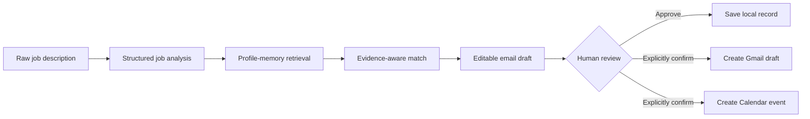

<div align="center">

# JobCopilot

### Evidence-grounded, human-supervised agentic AI for job applications

JobCopilot converts a raw job description into a structured and reviewable workflow: offer extraction, semantic profile retrieval, candidate-to-role matching, tailored email drafting, local application tracking and explicitly approved Gmail or Calendar actions.


</div>

---

## Why this project exists

Job applications are repetitive, fragmented and often written from generic summaries rather than verifiable candidate evidence.

JobCopilot explores a more reliable process:

1. extract the requirements explicitly stated in an offer;
2. retrieve only relevant evidence from a candidate memory;
3. separate strengths, gaps and positioning suggestions;
4. draft an application using the retrieved evidence;
5. keep the human in control before external side effects;
6. track the application and prepare a follow-up;
7. evaluate the system with reproducible metrics rather than screenshots alone.

The project is not designed for indiscriminate mass applications. It is a **traceable, local and supervised AI engineering case study**.

---

## Recruiter quick scan

| Capability | Current implementation |
| --- | --- |
| Structured job understanding | Anthropic LLM output validated with Pydantic |
| Candidate memory | Hugging Face embeddings and FAISS retrieval |
| Evidence-aware matching | Explicit strengths, gaps and relevant profile memories |
| Email generation | Structured and editable application draft |
| Deterministic orchestration | Stateless LangGraph pipeline |
| Conversational orchestration | LangGraph tool-calling agent with isolated chat threads |
| Gmail and Calendar | Local Google OAuth with explicit confirmation gates |
| Persistence | Atomic local JSON writes with duplicate checks |
| Evaluation | Extraction metrics and synthetic starter benchmark |
| Delivery | Streamlit UI, Dockerfile and GitHub Actions CI |

---

## System architecture



### Deterministic pipeline

```text
analyze_job
    -> retrieve_memory
    -> generate_match
    -> generate_email
```

The deterministic graph is compiled without a shared checkpointer. Each execution is stateless, which prevents job analyses from being mixed across sessions.

### Tool-calling agent

The conversational agent can:

- run the full JobCopilot pipeline;
- preview a Gmail draft action;
- preview a Calendar follow-up action;
- save an application record locally;
- list saved applications.

Gmail and Calendar tools require `confirmed=true`. The agent is instructed to show the exact action and request confirmation before that flag may be used.

---

## Reliability and safety choices

### Structured outputs

`JobAnalysis`, `MatchInsight`, `EmailDraft` and `ApplicationRecord` are validated with Pydantic. Required text, reminder dates, email subjects and ISO timestamps have explicit validation boundaries.

### Evidence grounding

The matching prompt is restricted to:

- the structured job analysis;
- retrieved candidate memories.

The email prompt must not transform a suggestion or an unsupported skill into a candidate claim.

### External-action approval

The agent cannot create a Gmail draft or Calendar event merely because a user mentioned one. It first returns a preview and requires explicit confirmation of:

- recipient, subject and body for Gmail;
- company, role and date for Calendar.

The dedicated Streamlit buttons represent direct user approval because the editable values are visible before the click.

### Safer FAISS handling

LangChain FAISS persistence includes pickle-backed metadata. Persisted-store deserialization is therefore disabled by default.

JobCopilot rebuilds the in-memory index from auditable JSON and caches it for the lifetime of the process. Loading a persisted index requires:

```env
ALLOW_TRUSTED_FAISS_DESERIALIZATION=true
```

This flag must only be used for an index generated locally and kept on a trusted machine.

### Atomic local persistence

Application records are written through a temporary file and atomically replace the target JSON file. Invalid JSON raises an explicit error instead of silently behaving like an empty database and risking data loss.

### Input validation

Before Gmail or Calendar calls, JobCopilot validates:

- email addresses;
- empty bodies and subjects;
- newline-based header injection attempts;
- follow-up date format;
- event start and end ordering.

See [`SECURITY.md`](SECURITY.md) for the complete trust model and deployment warnings.

---

## Public demo data versus private profile data

The repository ships with:

```text
data/profile_memories.example.json
```

This file contains a fictional candidate profile and makes the repository safe to demonstrate publicly.

For a personal local profile:

1. copy the example to `data/profile_memories.json`;
2. replace the entries with verified evidence;
3. set:

```env
PROFILE_MEMORIES_FILE=data/profile_memories.json
```

`data/profile_memories.json` is ignored by Git and must remain private.

---

## Evaluation

The repository includes a starter evaluation harness for structured job extraction.

```bash
python scripts/evaluate_job_extraction.py
```

The runner evaluates:

- normalized exact accuracy for scalar fields;
- set precision, recall and F1 for list fields;
- macro list-field F1;
- per-case predictions for error analysis.

The included dataset contains only synthetic test cases. It validates the evaluation pipeline but does **not** support production-accuracy claims.

See [`evaluation/README.md`](evaluation/README.md) for the protocol and benchmark roadmap.

Planned system-level evaluation includes:

- Recall@k and NDCG@k for candidate-memory retrieval;
- supported versus unsupported candidate-claim rate;
- human review of email relevance and factuality;
- tool-call success and duplicate-action rate;
- latency and model cost per workflow;
- regression comparisons across prompt and model versions.

---

## Repository structure

```text
app/
  agent_graph.py
  agent_state.py
  agent_tools.py
  config.py
  evaluation.py
  graph.py
  main.py
  memory.py
  prompts.py
  schemas.py
  state.py

  services/
    applications_store.py
    llm.py

  tools/
    gmail_tools.py
    calendar_tools.py

  ui/
    streamlit_app.py

data/
  profile_memories.example.json

evaluation/
  README.md
  job_offers.sample.jsonl

scripts/
  evaluate_job_extraction.py

tests/
  test_agent_safety.py
  test_applications_store.py
  test_calendar_tools.py
  test_evaluation.py
  test_gmail_tools.py
  test_schemas.py

.github/workflows/ci.yml
Dockerfile
SECURITY.md
```

---

## Local setup

### 1. Clone and create an environment

```bash
git clone https://github.com/EL-K-Code/Job-Copilot.git
cd Job-Copilot
python -m venv .venv
```

Linux or macOS:

```bash
source .venv/bin/activate
```

Windows PowerShell:

```powershell
.venv\Scripts\Activate.ps1
```

### 2. Install dependencies

```bash
pip install -r requirements.txt
```

For tests:

```bash
pip install -r requirements-dev.txt
```

### 3. Configure local variables

```bash
cp .env.example .env
```

At minimum, set:

```env
ANTHROPIC_API_KEY=your_local_key
ANTHROPIC_MODEL=your_supported_model
```

Never commit the resulting `.env` file.

### 4. Run the application

Backend workflow:

```bash
python -m app.main
```

Streamlit interface:

```bash
streamlit run app/ui/streamlit_app.py --server.address 127.0.0.1 --server.port 8501
```

---

## Google OAuth setup

To enable Gmail and Calendar actions locally:

1. create a Google Cloud project;
2. enable Gmail API and Google Calendar API;
3. configure the OAuth consent screen;
4. create a Desktop OAuth client;
5. save the downloaded client configuration as `credentials.json`;
6. run:

```bash
python -m app.bootstrap_gmail_auth
```

The OAuth file and generated tokens are ignored by Git.

---

## Docker

Build the local image:

```bash
docker build -t jobcopilot .
```

Run it with local configuration and data mounted explicitly:

```bash
docker run --rm -p 8501:8501 \
  --env-file .env \
  -v "$(pwd)/data:/app/data" \
  -v "$(pwd)/tokens:/app/tokens" \
  -v "$(pwd)/credentials.json:/app/credentials.json:ro" \
  jobcopilot
```

Do not bake credentials, OAuth tokens or personal profile files into the image.

---

## Tests and continuous integration

Run locally:

```bash
python -m compileall -q app tests
pytest -q
```

GitHub Actions runs the same syntax and unit-test checks for pull requests and pushes to `main`.

The current test suite covers:

- duplicate detection and atomic JSON persistence;
- corrupted-store behavior;
- agent confirmation gates;
- Gmail validation and header-injection rejection;
- Calendar payload validation;
- schema validation;
- evaluation metrics.

---

## Current boundaries

JobCopilot remains a **local engineering MVP**, not a production service.

Known limitations:

- JSON persistence is not transactional across concurrent processes;
- the agent checkpointer is in memory;
- there is no authentication or multi-user authorization;
- no public hosted deployment is configured;
- the extraction benchmark is still a small synthetic starter set;
- retrieval does not yet include a learned reranker or calibrated relevance threshold;
- Gmail and Calendar rely on local desktop OAuth;
- observability is limited and does not yet provide full traces, cost accounting or redacted audit logs.

---

## Engineering roadmap

1. expand the frozen human-annotated evaluation set;
2. add retrieval judgments, Recall@k and NDCG@k;
3. add candidate-claim support auditing;
4. migrate persistence to SQLite with migrations and repository interfaces;
5. introduce structured tracing and redacted audit logs;
6. add a reranking layer and retrieval thresholds;
7. add recorded approval metadata for every external action;
8. publish screenshots and a short synthetic-data demonstration;
9. deploy only after authentication, secret management and per-user isolation are implemented.

---

## What this project demonstrates

JobCopilot is designed to demonstrate more than prompt engineering:

- applied LLM engineering;
- structured extraction and validation;
- retrieval-augmented reasoning;
- semantic profile memory;
- deterministic and agentic LangGraph orchestration;
- human-supervised tool use;
- external API integration;
- evaluation engineering;
- security-aware product design;
- reproducible delivery with tests, CI and Docker.

---

## Author

**Komla Alex LABOU**  
Applied AI and Machine Learning Engineer — Research-Oriented

- GitHub: [EL-K-Code](https://github.com/EL-K-Code)
- LinkedIn: [komla-alex-labou](https://www.linkedin.com/in/komla-alex-labou/)
